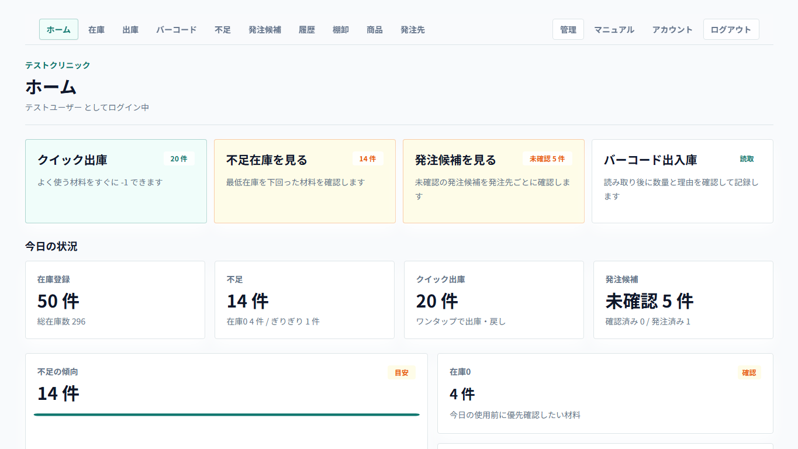
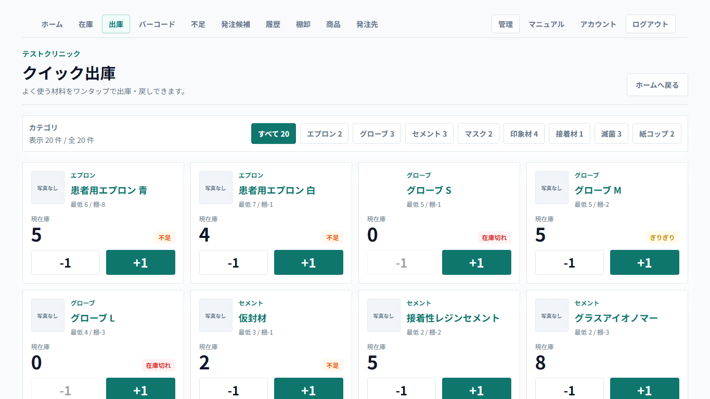
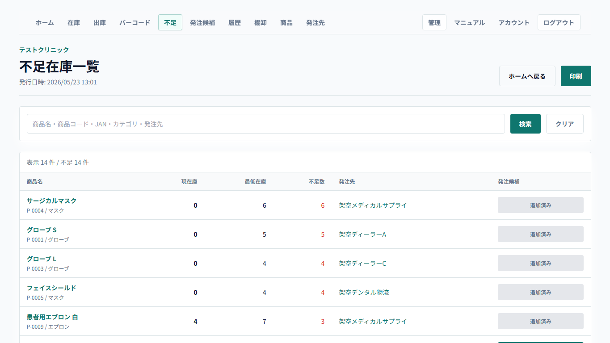
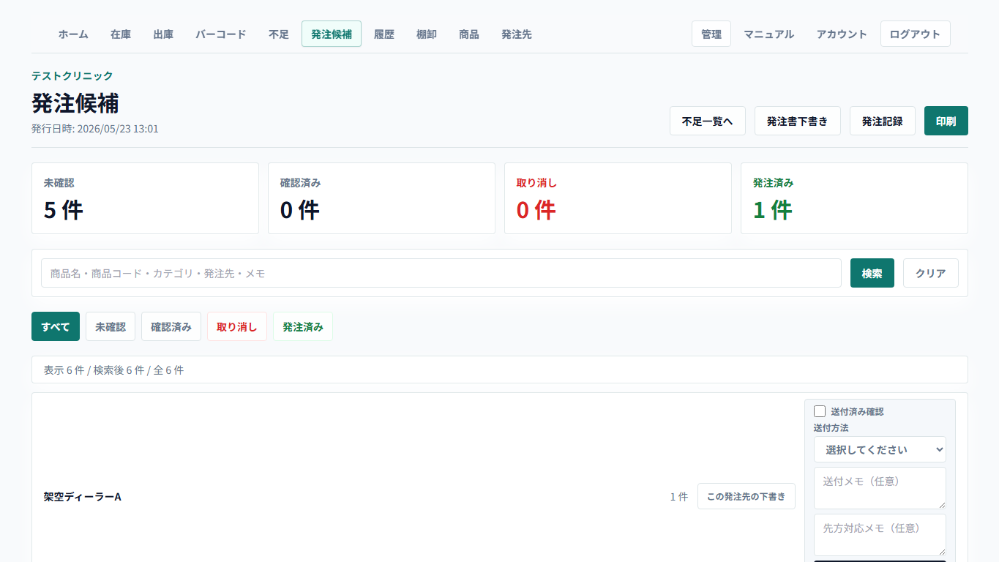
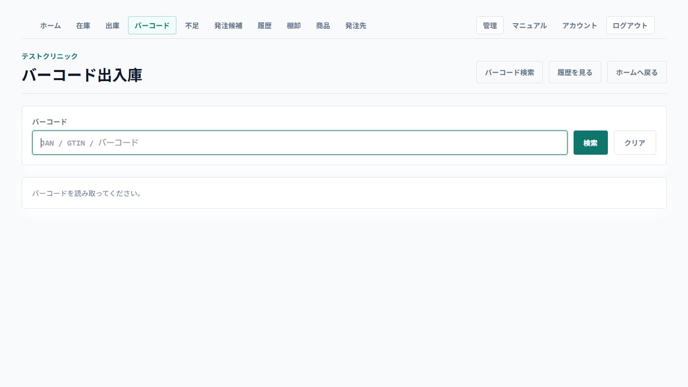

# 一般歯科材料在庫管理システム ご案内資料

最終更新日: 2026-05-23

この資料は、歯科クリニック向けに「一般歯科材料在庫管理システム」の概要と、公開デモで確認できる内容を説明するためのものです。

デモ環境では架空データを使用します。実在の患者情報、実在クリニック名、実在の商品データ、ログイン情報、パスワード、APIキー、データベース接続情報は記載しません。

## 1. このシステムで目指すこと

一般歯科材料、消耗品、備品について、日常の在庫確認、出庫、補充判断、発注候補確認を簡単にするためのWebアプリです。

現場では、材料の使用、残数確認、発注判断がスタッフごとに分かれやすく、紙やExcelだけでは次のような課題が起きやすくなります。

- どの商品が不足しているか分かりにくい
- 発注すべき商品が担当者の記憶に頼りやすい
- 在庫を減らした理由や、いつ誰が操作したかが残りにくい
- バーコードやロット番号、有効期限の情報を日常業務に活かしにくい
- 棚卸結果と普段の在庫数の差が追いにくい

このシステムでは、まず「在庫が見える」「不足が分かる」「よく使う材料をすぐ出庫できる」「発注候補を確認できる」状態を作ることを重視しています。

## 2. デモで確認できる主な機能

### ホーム画面

日常業務でよく使う操作を上部にまとめています。

- クイック出庫
- 不足在庫の確認
- 発注候補の確認
- バーコード出入庫

あわせて、在庫0の商品、不足在庫、未確認の発注候補、期限切れ・期限間近ロットなど、優先的に確認したい情報を表示します。

### クイック出庫

よく使う材料をカード形式で表示し、すばやく `-1` や `+1` ができます。

日常的な使用による出庫を想定しているため、毎回理由入力を求めず、操作履歴には「クイック出庫」として記録します。

理由を詳しく残したい在庫修正は、在庫一覧の直接編集やバーコード出入庫を使う想定です。

### 不足在庫

現在庫が最低在庫を下回っている商品だけを確認できます。

不足在庫から発注候補へ追加できるため、在庫確認から発注準備までをつなげられます。

### 発注候補・発注記録

不足商品を発注候補としてまとめ、発注先ごとに確認できます。

現在のデモでは、次のような流れを確認できます。

- 発注候補の確認
- 発注数量の調整
- 発注書下書きのブラウザ印刷
- 発注済みとして記録
- 送付方法や送付メモの記録
- 納品確認
- 必要に応じた在庫への入庫反映

外部へのメール送信、FAX送信、LINE送信、ディーラーへの自動発注は現時点では行いません。人が送付した後、その記録を残す形です。

### バーコード検索・バーコード出入庫

JANコードや登録済みバーコードから商品を検索できます。

バーコード出入庫では、商品が1件に特定できた場合に、数量と理由を確認して入庫・出庫を記録できます。

GS1形式のバーコードでは、対応できる範囲でロット番号や有効期限も読み取ります。

### ロット番号・有効期限

バーコード出入庫や納品確認時に、ロット番号や有効期限を在庫側へ保存できます。

期限切れ、期限間近、要確認のロットを一覧で確認できます。

### 棚卸

棚卸セッションを開始し、実在庫数を入力できます。

途中保存、スキップ、差異確認、確定、履歴確認ができます。

### 商品マスタ・発注先マスタ

商品、発注先、バーコード、主発注先、代替発注先などを管理できます。

商品写真も登録できます。

商品マスタはCSVまたはExcel貼り付け形式で一括取り込みする入口を用意しています。

## 3. 日常業務のイメージ

1. ホームを開く
2. よく使う材料はクイック出庫で減らす
3. 不足在庫を確認する
4. 必要なものを発注候補に追加する
5. 発注候補を発注先ごとに確認する
6. 発注書下書きを印刷またはPDF保存する
7. 人が発注先へ送付する
8. 送付後に発注済みとして記録する
9. 納品されたら納品確認を行う
10. 必要に応じて在庫へ入庫反映する

## 4. 試用開始までに必要な準備

本格的に試用する場合は、最初に商品マスタを整える必要があります。

最低限あるとよい情報は次の通りです。

- 商品名
- カテゴリ
- 現在庫
- 最低在庫
- 単位
- JANコードまたはバーコード
- 主な発注先
- 発注先の商品名や品番
- 発注単位

JANコードがあれば、バーコード検索やバーコード出入庫の土台として使えます。

ただし、JANコードだけで商品名、規格、発注先、価格、発注単位が自動的にすべて埋まるわけではありません。導入時は、ディーラーや院内の既存管理表から商品一覧のサンプルデータをもらい、それを取り込み形式に整える流れが現実的です。

## 5. 顧客確認時に見てほしいポイント

初回デモでは、細かい設定よりも次の点を確認してもらう想定です。

- ホーム画面から日常操作に入りやすいか
- クイック出庫の操作が現場の感覚に合うか
- 不足在庫から発注候補へ進む流れが自然か
- 発注候補の見え方が、現在の発注業務に合いそうか
- バーコード出入庫を使う場面がありそうか
- 商品マスタに必要な項目が不足していないか
- 導入時にどの形式の商品一覧データなら用意できそうか

## 6. 現時点でできないこと

次の機能は、現時点では未実装または運用確認後に検討する範囲です。

- ディーラーへの自動発注
- メール、FAX、LINEの自動送信
- アプリ内での正式なPDF発注書生成
- 分納、未納、欠品、納品書照合を含む本格的な納品管理
- 複数クリニックの切替画面
- 医療機器や滅菌物の法的管理を目的とした厳密な管理機能
- 本番運用向けの契約、バックアップ、障害対応ルールの確定

デモでは、あくまで歯科材料・消耗品の在庫管理と発注準備を支援する範囲として確認します。

## 7. デモ時の注意

- デモ環境のデータは架空データです。
- 実在患者情報や個人情報は入力しません。
- 実在クリニック名、実在顧客名、秘密情報は入力しません。
- デモ環境での操作結果は、正式な業務記録としては扱いません。
- ログイン情報は別途、安全な方法で共有します。

## 8. 次の進め方

デモを見て問題なければ、次の流れで試用準備に進みます。

1. 顧客に画面を見てもらう
2. 試用するかどうかを確認する
3. 試用する場合、ディーラーや院内管理表から商品一覧のサンプルデータを用意する
4. 取り込み項目を確認する
5. 商品マスタを整形して一括取り込みする
6. 実際の業務に近い形で試用する
7. 不足項目や運用ルールを確認する

最初から完璧なマスタを作るより、よく使う商品から始めて、実際の運用に合わせて整えていく進め方が現実的です。
